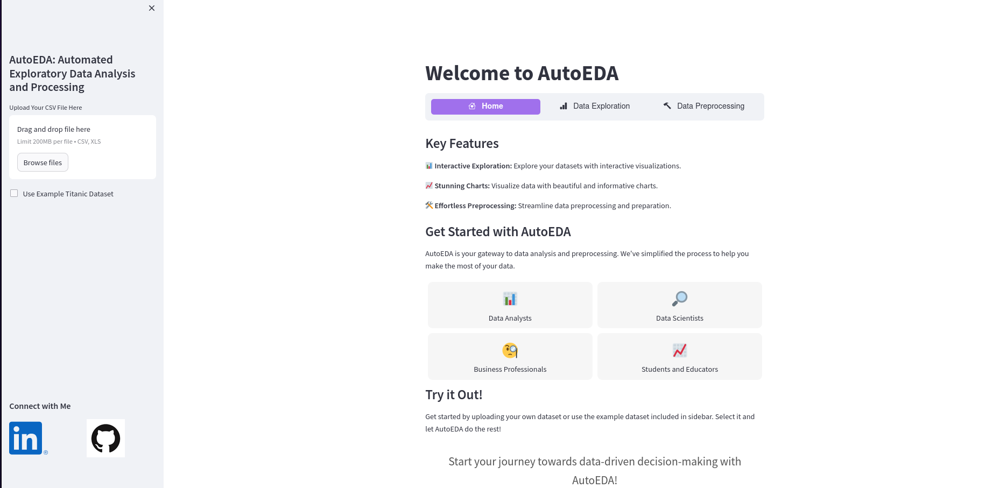

# AutoEDA: Automated Exploratory Data Analysis

<!--  -->

AutoEDA is an open-source Python application designed to streamline the process of Exploratory Data Analysis (EDA) for data scientists, analysts, and anyone working with data. EDA is a crucial step in understanding your dataset, finding patterns, and preparing data for further analysis. AutoEDA simplifies this process by providing an interactive web-based platform to explore, visualize, and preprocess your data effortlessly.

## Preview

This is the home screen of the web application. From here, you can upload any dataset you want and perform Exploratory Data Analysis right through the web.

## Key Features

- Dataset Overview: Quickly load and preview your dataset, understand its structure, and check for missing data.

- Data Exploration and Visualization: Explore individual features, visualize their distributions, and analyze relationships between variables. Create charts, scatter plots, and correlation heatmaps with ease.

- Automated Data Preprocessing: Upcoming feature! Automate data preprocessing steps, including handling missing data, encoding categorical variables, scaling, and more.

- Log of Preprocessing Steps: Keep a log of the preprocessing steps performed on your dataset, making it easy to track and reproduce your data preparation process.

## Why AutoEDA?

- Efficiency: AutoEDA automates routine EDA tasks, saving you time and effort.

- Interactivity: Visualize your data interactively to gain insights quickly.

- Reproducibility: Maintain a log of data preprocessing steps for transparency and reproducibility.

- User-Friendly: No coding required. All tasks can be performed using the user-friendly web interface.

## Current Progress

**Dataset Overview:** Users can load and preview their datasets, access basic dataset statistics, and check for missing data.

**Data Exploration and Visualization:** Users can explore numerical and categorical features, create histograms, scatter plots, and other visualizations.

## Roadmap

I am actively working on implementing the data preprocessing feature. Soon, you'll be able to perform tasks like handling missing data, encoding categorical variables, and more, directly from the web interface. This will further simplify your data preparation process.

## Try AutoEDA

I invite you to try AutoEDA for yourself. Upload your dataset, explore its features, and visualize the data. We appreciate your feedback and suggestions to make AutoEDA even better.

Install the necessary libraries

`pip install pandas matplotlib numpy plotly streamlit seaborn`

To start the application, just run the following line in terminal

`streamlit run main.py`

This will run the web application on your default web browser

## Contibutions
AutoEDA is an open-source project, and I welcome contributions from the community. You can help by reporting issues, contributing code, or suggesting new features.
